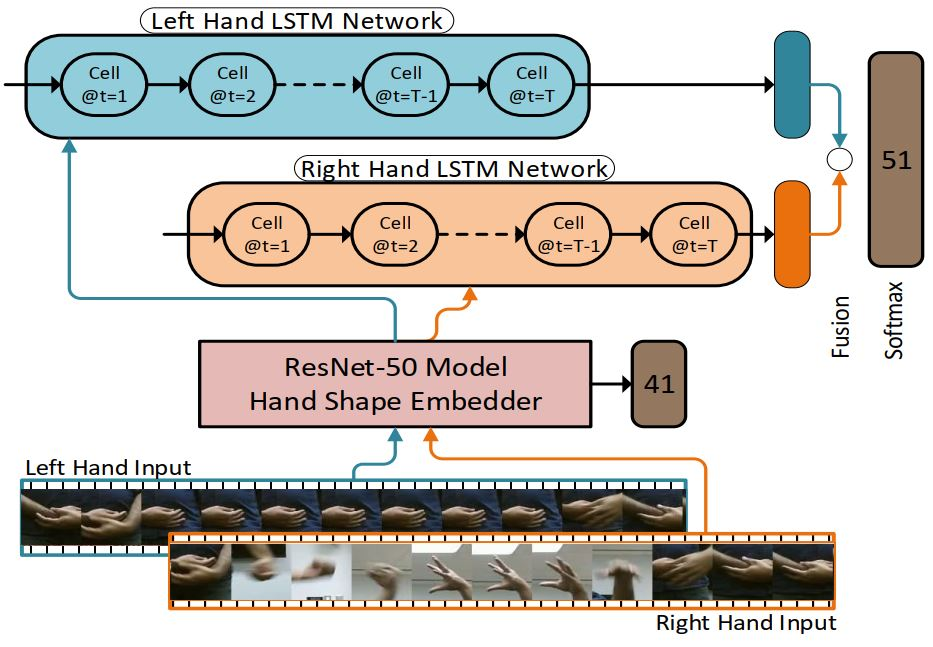

# FineHand
Semi-automatic hand shape learning from videos in the context of sign language recognition  
Here is the diagram of the overall architecture,   

   
The project is divided into trainning two neural networks. One network is hand shape CNN responsible for learning hand shape patterns from images, the other one is a recurrent neural network (RNN) variation, which takes per frame hand shape representation and learns different signs.
## Network 1 : Hand shape network
This is a image recognition type convolutional neural netowrk (CNN). An instance of ResNet50 was used here. Any other compatible CNN can be used. The goal of this CNN is to learn hand shape patterns as shown below. The per frame learned representation will be used later in the sign recognition phase.

### Training 

### Evaluation

## Network 2 : Recurrent Sign recognition network

### Training 

### Evaluation

